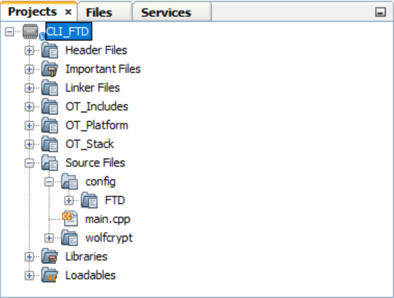
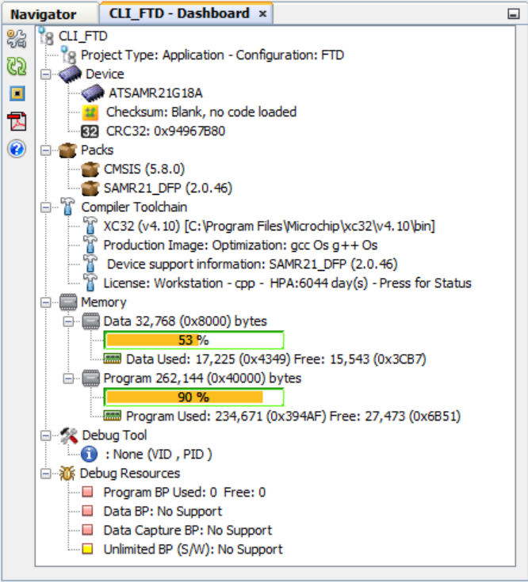
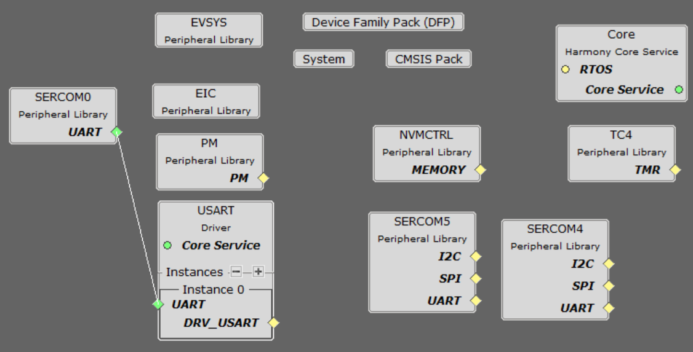
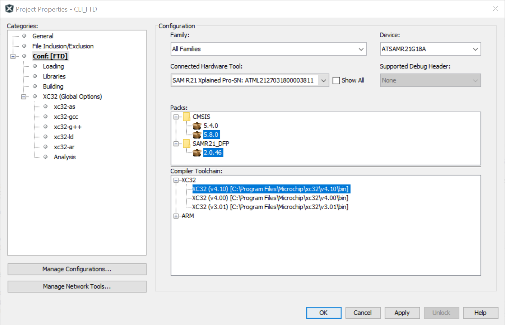
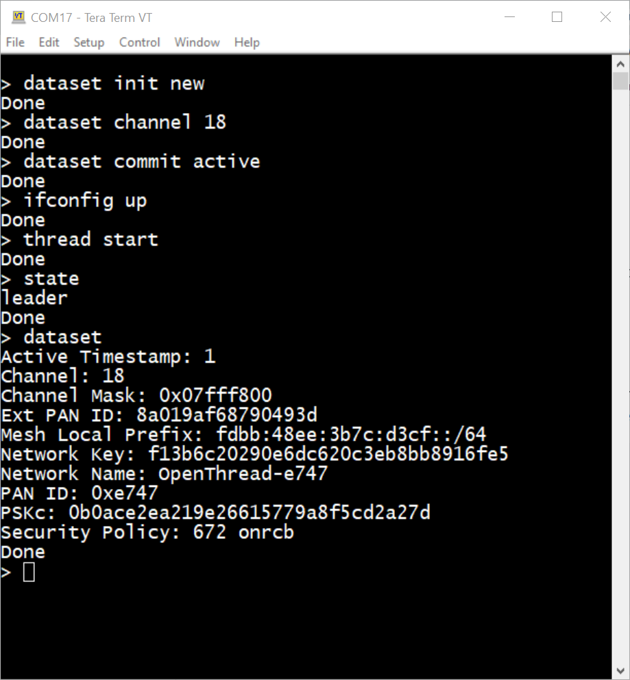
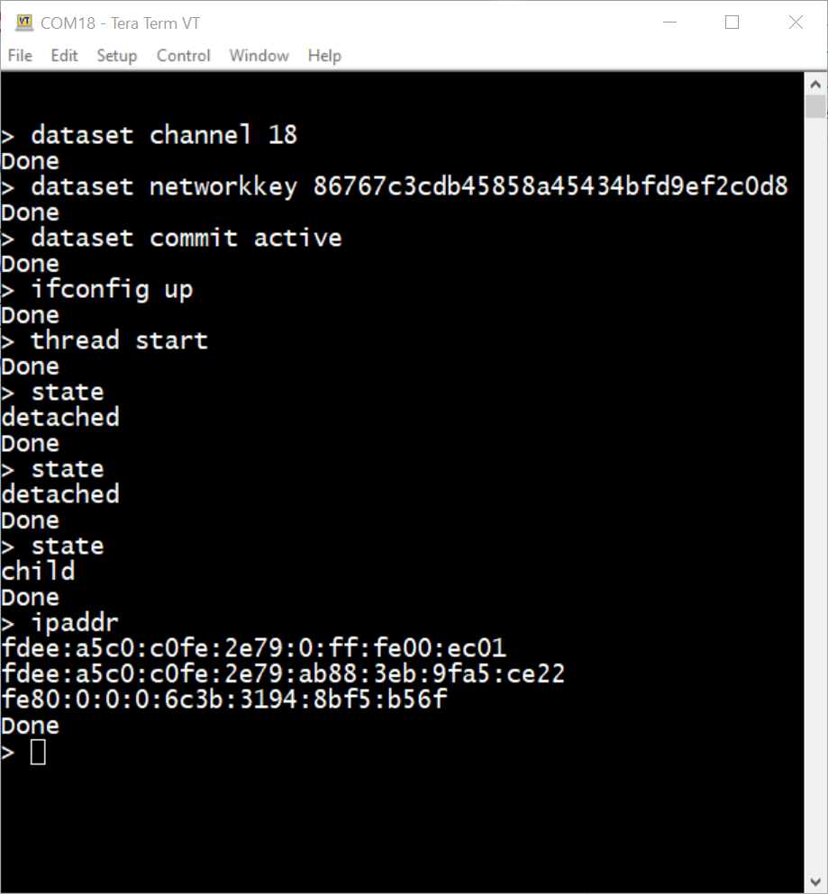
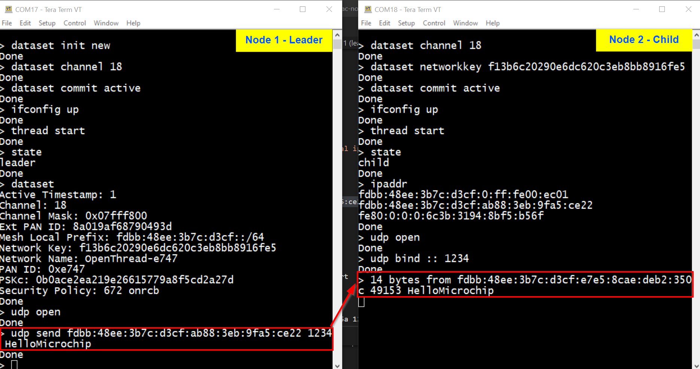

# ATSAMR21_OPENTHREAD_H3


> "IoT Made Easy!" - Build and Test an OpenThread Application using Microchip MPLAB X IDE with SAM R21 SoC 

Devices: **ATSAMR21**<br>
Features: **OpenThread | FTD | CLI**

## ⚠ Disclaimer

<p><span style="color:red"><b>
THE SOFTWARE ARE PROVIDED "AS IS" AND GIVE A PATH FOR SELF-SUPPORT AND SELF-MAINTENANCE. This repository contains example code intended to help accelerate client product development. </br>

For additional Microchip repos, see: <a href="https://github.com/Microchip-MPLAB-Harmony" target="_blank">https://github.com/Microchip-MPLAB-Harmony</a>

Checkout the <a href="https://microchipsupport.force.com/s/" target="_blank">Technical support portal</a> to access our knowledge base, community forums or submit support ticket requests.
</span></p></b>

## A la carte

1. [Introduction](#step1)
1. [Bill of materials](#step2)
1. [Hardware Setup](#step3)
1. [Software Setup](#step4)
1. [Repository Structure](#step5)
1. [MCC Harmony Configuration](#step6)
1. [Board Programming](#step7)
1. [Run the demo](#step8)
   1. [Form a network](#step8a)
   1. [Join the network](#step8b)
   1. [Enable leader to child communication](#step8c)
   1. [More CLI commands](#step8d)
1. [Known limitations](#step9)

## Introduction<a name="step1"></a>

This application, made for testing purpose, demonstrates how to enable a simple wireless communication with a [Full Thread Devices (FTD)](https://openthread.io/guides/thread-primer/node-roles-and-types) over a simple Command Line Interface (CLI).

It is based on [OpenThread for SAM R21](https://github.com/openthread/ot-samr21) implementation ported by the community. More details [here](https://openthread.io/platforms).

Typically, a Full Thread Device (FTD) has always its radio ON, subscribes to the all-routers multicast address, and maintains IPv6 address mappings.

This example application exposes OpenThread configuration and management APIs via a simple Command Line Interface (CLI). 

Moreover, this repository describes the setup required to create a build and test CLI FTD Application for OpenThread stack running on [SAMR21G18A SoC](https://www.microchip.com/en-us/product/ATSAMR21G18A). 

It provides the following:
* Lists the software tools and devices required to setup the test environment
* Steps to build the OpenThread CLI firmware
* Steps to program the DUTs with OpenThread firmware
* Steps to perform the following tests with DUTs:
  * Network formation between 1 FTD leader and 1 FTD child
  * UDP communication from a leader to a child

For more details on OpenThread implementation:
- checkout the [OpenThread GitHub repo](https://github.com/openthread/)
- checkout the [OpenThread.io](https://openthread.io/) webpage

## Bill of materials<a name="step2"></a>

Two sets of the following hardware are required:

* [SAM R21 Xplained Pro Evaluation Kit](https://www.microchip.com/en-us/development-tool/ATSAMR21-XPRO)
* A micro-USB cable

## Hardware Setup<a name="step3"></a>

* Simply plug the SAM R21 Xplained Pro EVK through the EDBG USB connector to the computer using a micro-USB cable

## Software Setup<a name="step4"></a>

[Clone](https://docs.github.com/en/repositories/creating-and-managing-repositories/cloning-a-repository) this repository to your local computer. Make sure to clone it in the root directory (e.g. C:\\ot-samr21).

The sample project has been created and tested with the following Software Development Tools:
- [MPLAB X IDE v6.00](https://www.microchip.com/en-us/development-tools-tools-and-software/mplab-x-ide)
- [MPLAB X IPE v6.00](https://www.microchip.com/en-us/development-tools-tools-and-software/mplab-x-ide)
- [MPLAB XC32 v4.10](https://www.microchip.com/en-us/development-tools-tools-and-software/mplab-xc-compilers)

> -Os settings MUST be enabled manually by adding FULL XC32 compiler licence from registering at [http://licenses.microchip.com/ ](http://licenses.microchip.com/)

- SAMR21_DFP v2.0.46
  - Install SAM R21 Device Family Pack (DFP) from MPLAB X IDE
    - Tools -> Packs
    - Go to Device Family Packs tab
    - Select Install Pack from Local Source
    - Locate the folder *mplab_x_ide* from the cloned repository and select the device family pack *Microchip.SAMR21_DFP-2.0.46.atpack*
    - Verify the installation of the device family pack by typing *samr21* in the search bar
    - Close and restart MPLAB X IDE

- EDBG_TP v1.4.384
  - To program SAM R21 Xplained Pro board, install the Tool Packs (TP) from MPLAB X IDE
    - Tools -> Packs
    - Go to Tool Packs tab
    - Install/update the Tool Packs: EDBG_TP v1.4.384
    - Close and restart MPLAB X IDE

- [MPLAB Code Configurator v5.1.17](https://www.microchip.com/en-us/tools-resources/configure/mplab-code-configurator)
   - [csp v3.11.0](https://github.com/Microchip-MPLAB-Harmony/csp/tree/v3.11.0)
   - [core v3.10.0](https://github.com/Microchip-MPLAB-Harmony/core/tree/v3.10.0)
   - [dev_packs v3.11.2](https://github.com/Microchip-MPLAB-Harmony/dev_packs/tree/v3.11.2)
   - [wolfssl v4.7.0](https://github.com/Microchip-MPLAB-Harmony/wolfssl/tree/v4.7.0)
   - [crypto v3.7.5](https://github.com/Microchip-MPLAB-Harmony/crypto/tree/v3.7.6)

The following additional software tools are required for running the project:
- Any Serial Terminal application like [Tera Term](https://osdn.net/projects/ttssh2/releases/) terminal application


## Repository Structure<a name="step5"></a>

The ot-samr21 directory is organized as below: 

```bash
├── examples/
├── openthread/
├── script/
├── src/
├── third_party/
├── CMakeLists.txt
├── LICENSE
└── README.md
```

| Folder |	Description |
| ------ | ------------ |
| examples |	CLI Example applications ported to MPLAB MCC Harmony framework |
| openthread | The openthread repository as a submodule |
| script	| Scripts for building, testing, linting |
| src |	The platform abstraction layer implementation |
| third_party |	Location for any third-party sources |


## MCC Harmony Configuration<a name="step6"></a>

### Project structure

<p align="center">

</p>

### Project dashboard

<p align="center">

</p>

```bash
Total ROM used  :     0x394af      234671  89.5% of 0x40000
        --------------------------------------------------------------------------
         Total Program Memory used  :     0x394af      234671  89.5% of 0x40000
        --------------------------------------------------------------------------


Total RAM used  :      0x4349       17225  52.6% of 0x8000
        --------------------------------------------------------------------------
            Total Data Memory used  :      0x4349       17225  52.6% of 0x8000
        --------------------------------------------------------------------------
```

### Project graph

<p align="center">

</p>


## Board Programming<a name="step7"></a>

Make sure the SAM R21 Xplained Pro Kits are plugged to the computer through micro-USB cables.

### Program the precompiled hex file using MPLAB X IPE

Using MPLAB IPE:
* Select **ATSAMR21G18A** as Device flash and hit the *Apply* button
* Select the tool connected: **EDBG**
* Browse for the following file: *hex/CLI_FTD.X.production.hex*
* Hit the *Program* button
* Repeat the above steps for the second kit

### Build and program the application using MPLAB X IDE

Using MPLAB IDE:
* Check the settings in the project properties

<p align="center">

</p>

* Compile the application by clicking on the *Clean and Build* button
* Program the application to the device by clicking on the *Make and Program* button


## Run the demo<a name="step8"></a>

### Form a network<a name="step8a"></a>

To create the network, start with the router eligible Node 1 (Leader) and enter the following commands.

#### Node 1 commands

Press `Enter` to see a prompt `>`. 

- Start by issuing the command to create a new network configuration
- Set a particular channel
- Commit new dataset to the active operational dataset
- Bring up the Thread IPv6 interface
- Start Thread protocol operation
- Wait few seconds
- Read the current state of the node. It should be the Leader
- View the network configuration and make note of the Network Key which will be used later 

```bash
> dataset init new
Done
> dataset channel 18
Done
> dataset commit active
Done
> ifconfig up
Done
> thread start
Done
> state
Leader
> dataset
...
```

#### Node 1 console

Serial Port Setup: 115200 / 8 / N / 1

According to the response of the command state and dataset, the leader is created.

<p align="center">

</p>

### Join the network<a name="step8b"></a>

To add child Node 2 to the network, enter the commands lines below in the console.

#### Node 2 commands

Press `Enter` to see a prompt `>`. 

- Start by setting the channel used in the alive network which is to decrease latency
- Set the Network Key of the leader. This step is required for a device to attach to a Thread network
- Commit new dataset to the active operational dataset
- Bring up the Thread IPv6 interface
- Start Thread protocol operation
- Wait few seconds
- Read the current status of the node. It should be a Child
- Check its IPv6 address using `ipaddr` command. Make note of the Mesh-Local IPv6 address which will be use later.

*Note: the `ipaddr` command should return 3 IPv6 addresses</br>xxxx:xxxx:xxxx:xxxx:xxxx:xxxx:xxxx:xxxx First one corresponds to the Routing Locator (RLOC): this address is created when the device is attached to the network, and is generally not used by applications</br>xxxx:xxxx:xxxx:xxxx:xxxx:xxxx:xxxx:xxxx This one is the Mesh-Local EID (ML-EID): this address is independent of the network topology, and is
used to communicate with the other interface in the same thread network</br>xxxx:xxxx:xxxx:xxxx:xxxx:xxxx:xxxx:xxxx The last one is the Link-Local Address (LLA): this address starts with fe80::/16 prefix, it is created with the MAC address. It is not used to communicate between nodes. We can still use them between two nodes if there is only a link, one radio transmission, not more than one cable to retransmit the message*

```bash
> dataset channel 18
Done
> dataset networkkey f13b6c20290e6dc620c3eb8bb8916fe5
Done
> dataset commit active
Done
> ifconfig up
Done
> thread start
Done
> state
child
> ipaddr
fdde:a5c0:c0fe:2e79:0:ff:fe00:ec01
fdde:a5c0:c0fe:2e79:ab88:3eb:9fa5:ce22
fe80:0:0:0:6c3b:3194:8bf5:b56f
Done
```

#### Node 2 console

Serial Port Setup: 115200 / 8 / N / 1

<p align="center">

</p>

### Enable leader to child communication<a name="step8c"></a>

One of the application services that OpenThread provides is User Datagram Protocol (UDP), a transport Layer protocol. An application built on OpenThread could use the UDP API to pass messages between nodes in a Thread network, or to other devices in an external network (like the internet, if the Thread network features a Border Router).

UDP sockets are exposed through the OpenThread CLI. Let's use it to pass messages between the two FTDs.

Get the Mesh-Local EID address for the FTD Joiner. We're using this address because it's reachable from anywhere within the Thread network.

#### Node 2 (child) commands

- Open UDP socket
- Bind UDP to a socket for any IPv6 address using `udp bind :: <udp port number>`

*Note: The `::` specifies the IPv6 Unspecified Address*

```bash
> udp open
Done
> udp bind :: 1234
Done
```

#### Node 1 (leader) commands

- Open UDP socket
- Send UDP packet using `udp send <mesh-local ip address> <udp port number> <string>`

```bash
> udp open
Done
> udp send fdbb:48ee:3b7c:d3cf:ab88:3eb:9fa5:ce22 1234 HelloMicrochip
Done
```

#### Node 2 (child) result

On Node 2, you should see a print out similar to below:

```bash
> 14 bytes from fdbb:48ee:3b7c:d3cf:e7e5:8cae:deb2:350c 49153 HelloMicrochip
```

#### Node consoles

<p align="center">

</p>

### More CLI commands<a name="step8d"></a>

For a list of all available commands, visit [OpenThread CLI Reference README.md][cli]

[cli]: https://github.com/openthread/openthread/blob/main/src/cli/README.md


## Known limitations<a name="step9"></a>

1. This [OpenThread implementation for SAM R21](https://github.com/openthread/ot-samr21) is originally coming from [community ports](https://openthread.io/platforms/community/microchip). The [OpenThread.io](https://openthread.io/platforms#support) website claims these platforms have not been fully tested and may be missing some key functionality.

2. Multiple ping option is disabled.


<a href="#top">Back to top</a>